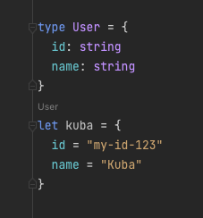

# is better TypeScript or F#?

Today I'll try to compare two different programming languages, **F#** and **TypeScript**.
Both of them are multiplatform, high-level, and statically-typed so we're able to use them to write any kind of type-safe application like web-servers, native-client-apps, web-applications or we can use them for daily scripting instead of tools like a shell.

## Comparison categories

I would like to focus on few concepts of a language which we will compare in this article. Those categories are:

1. [Data-type inferring](#1-data-type-inferring)
2. [Generic inferring](#2-generic-inferring)
3. [Dynamic object types](#3-dynamic-object-types)
4. [Null pointer exceptions](#4-null-pointer-exceptions)
5. [Pattern matching](#5-pattern-matching)
6. [Modules import system](#6-modules-import-system)
7. [Runtime optimization](#7-runtime-optimization)
8. [Not compiled to the Microsoft ecosystem](#8-not-compiled-to-the-microsoft-ecosystem)


## 1. Data-type inferring

F# is a strongly-typed language that implemented an algorithm called `Hindley–Milner`. That algorithm analyzes your codebase and infers as much as possible static types.

If we want to do a function to sum 2 numbers in TypeScript, we have to define data types for both arguments, and the TypeScript compiler will infer the Return type

**TS**
```ts
// this is function whitch takes 2 arguments: `a` & `b`, function sum those numbers and returns value
let sum = (a: number, b: number) => a + b
```


On the other side, F# analyse the source code and found that operator `+` can be called on two integers so it infers data types of arguments. As you can see F# code looks like another scripting language without static types but because of terrific inferring algorithm of F# compiler it's type-safe strongly typed codebase.

**F#**
```fs
// this is function whitch takes 2 arguments: `a` & `b`, function sum those numbers and returns value
let sum a b = a + b
```

> F# is running on `.net` ecosystem so it makes differences between `float` and `int`, TypeScript does not

**conclusion: F# won 🏆**


## 2. Generic inferring

TypeScript use angle brackets `<T>` for generics. This is very similar to languages like `C++`, `Java` or `C#`. F# use just simple apostrophe `'T` for it.

In the TypeScript, we're able to infer simple returns value and variable declarations, but if you want to have dynamic arguments like on the example:

```ts
const toDoubleTuple = <T>(anything: T): [T, T] => [anything, anything]
```

you have to define, that argument `anything` is of some generic type `T` and the function takes a type of `anything`, and returns a tuple of `[anything, anything]`

As you may suggest, F# is so smart that he can even infer generics of our function.

```fs
let toDoubleTuple anything = anything, anything
```


Again, F# analyze the source code and found that if a function takes `anything` type and returns a tuple of `anything, anything`. F# compiler infers that argument is of Generic type `'a`. This code looks like a dynamic scripting language like Python but it has a powerful 100% type-safe runtime. F# compiler is a piece of art.

**conclusion: F# won 🏆**


## 3. Dynamic object types

Now, let's compare how to create data-type and structural data objects. Let's start with F#.

**F#**
```fs
type User = {
  id: string
  name: string
}

let kuba = {
  id = "my-id-123"
  name = "Kuba"
}
```



As you can see F# has `structural based data object types`. It means that F# compiler founds that there exists an object type with attribute `id: string` and `name: string` and it automatically infers data-type of it.

In TypeScript, if we create a data type, we have to sign that data type into the variable.

**TS**
```ts
type User = {
  id: string
  name: string
}
// assign data-type to the variable
let kuba: User = {
  id: 'my-id-123',
  name: 'Kuba'
}
```

It's verbose so we have an alternative in the TypeScript and we can infer data-type directly from the data by using the keyword `typeof`.

**TS**
```ts
let kuba = {
  id: 'my-id-123',
  name: 'Kuba'
}
type User = typeof kuba
```


Thanks to that TypeScript approach, we may use TypeScript generics like `Omit`, `Pick`, and so on.

F# structural-based data object types are awesome but here the TypeScript has much nicer, minimalist, and more powerful tools to define data types from raw data.

**conclusion: TypeScript won 🏆**


## 4. Null pointer exceptions

In JavaScript we have a few nullable values: `null`, `undefined`, `0`, `NaN`, `""`. It makes us hard to handle the runtime properly.
Thanks to TypeScript we can check the types more strictly.

```ts
let pipePrint = <T>(data: T | undefined | null) => {
  if (data === undefined || data === null || isNan(data)) {
    console.log('no value provided')
  } else {
    console.log(data)
  }
}
````

F# decided not to implement those nullable values and focused to force you to strictly handle edge-cases. So in F# core there is defined union type called [`Option`](https://fsharpforfunandprofit.com/posts/the-option-type/)
It's defined as:
```fs
type Option<'a> =       // use a generic definition
   | Some of 'a           // valid value
   | None                 // missing value
```

If we wrap some value in that `Option` type, we're able to check if the value exists or if the value is empty.

```fs
let pipePrint data = 
   match data with
     | Some x -> printf x
     | None -> printf "no value provided"
```

Thanks to that F# compiler forces us to handle all non-valid potential null pointer exceptions errors which are good. But in TypeScript, we have the same value if we correctly type 100% of our codebase. So in this category is a draw and there is no winner.

**conclusion: no winner**


## 5. Pattern matching

Pattern matching is a really powerful part of F# language design. There are many sources where you can find more information, like [there](https://docs.microsoft.com/en-us/dotnet/fsharp/language-reference/pattern-matching) or [there](https://fsharpforfunandprofit.com/posts/match-expression/).

TLDR:
Pattern matching in JavaScript/TypeScript is bad, not flexible, and bad again. So there the F# is the winner.

I put here one of many examples of the powerfulness of pattern-matching in F#.

```fs
let vectorLength vec =
    match vec with
    | [| var1 |] -> var1
    | [| var1; var2 |] -> sqrt (var1 * var1 + var2 * var2)
    | [| var1; var2; var3 |] -> sqrt (var1 * var1 + var2 * var2 + var3 * var3)
    | _ -> failwith (sprintf "vectorLength called with an unsupported array size of %d." (vec.Length))
```

**conclusion: F# won 🏆**

### Modules import system

TODO: add texts...

**conclusion: Typescript won 🏆**

## 7. Runtime optimization

Both languages have really strong type inference systems. It means that the compiler will check the code and suggest (infer) the best static type to use. Thanks to that, you are able not to define static-type in the code on your own. It helps you to make a better development experience with less writing, but more readable, self-documented, and less error-prone code.

TypeScript is a highly dynamic language so if we compile our TypeScript code into the vanilla JavaScript. It removes static types and we're not able to use those metadata to optimize JavaScript runtime like memory allocation and CPU time.

On the other hand thanks to the fact that TypeScript is a tool for better developer experience we're able to use expressions like `as any`, `: any`, `@ts-expect-error`, `@ts-ignore` and not to be too strict.

It means that both approaches have cons and props there is no winner in this category.

**conclusion: no winner**


## 8. Not compiled to the Microsoft ecosystem

As you may know. F# is developed by Microsoft and it runs on the .net platform created by Microsoft. Typescript is also created by Microsoft but the final output is pure vanilla JavaScript which is not owned by any large mega corporate. Thanks to that it gave us as developers the option to not be locked into the ecosystem of some mega-corporate and feel more free and independent. Maybe this point could be stupid for you but I believe that it's better to develop in a language that is not so directly connected to anyone.

**conclusion: Typescript won 🏆**


## Final sum

So, Let's check the results of categories:

|                                             | F# | TS |
| ------------------------------------------- | -- | -- |
| 1. Data-type inferring                      | 🏆 |    |
| 2. Generic inferring                        | 🏆 |    |
| 3. Dynamic object types                     |    | 🏆 |
| 4. Null pointer exceptions                  | -- | -- |
| 5. Pattern matching                         | 🏆 |    |
| 6. Modules import system                    |    | 🏆 |
| 7. Runtime optimization                     | -- | -- |
| 8. Not compiled to the Microsoft ecosystem  |    | 🏆 |

So as you you can see, it's hard to decide which language I like and prefer more. 
In conclusion, my dreamed language will be F# with Javascript ES6 module system and object data inferring via `typeof` designed by ECMA standard.

**If you enjoyed reading the article don’t forget to like this article**


